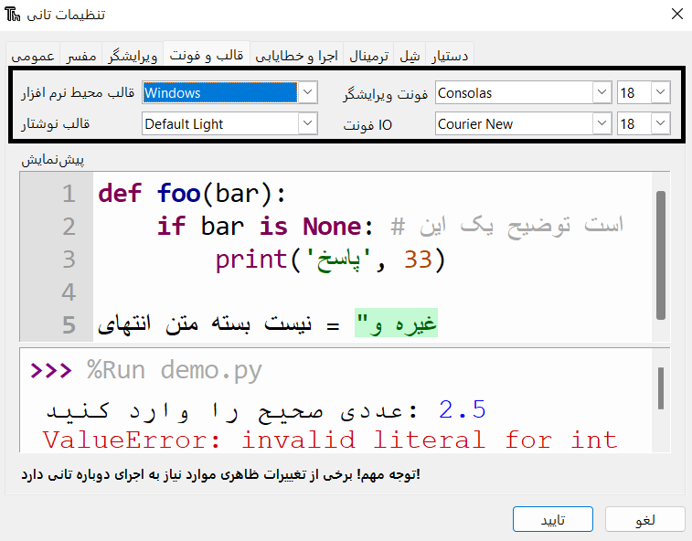

يسمح لك Thonny بتغيير موضوع وخط البرنامج. This feature means that you can increase the font size and change the background and text colours to suit your needs.

To change the theme and font:

+ Click on Tools -> Options.
+ Click on the 'Theme & Font' tab.
+ Click on the drop down boxes for each option until you find the settings that best suit your needs.

+ اضغط على "OK" عند الانتهاء.

**Warning**: Stick to simple, clean fonts. If you use a handwriting style font then it can make it difficult to read and debug.

