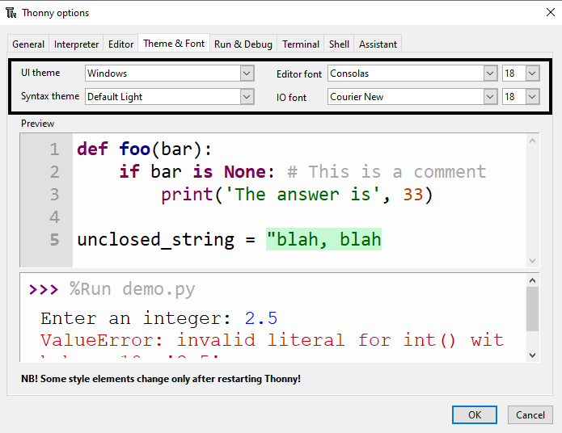

Thonny allows you to change the theme and font of the software. This feature means that you can increase the font size and change the background and text colours to suit your needs. 

## Find the theme and font menu

In Thonny, click on Tools -> Options.

Next, click on the 'Theme & Font' tab. 

