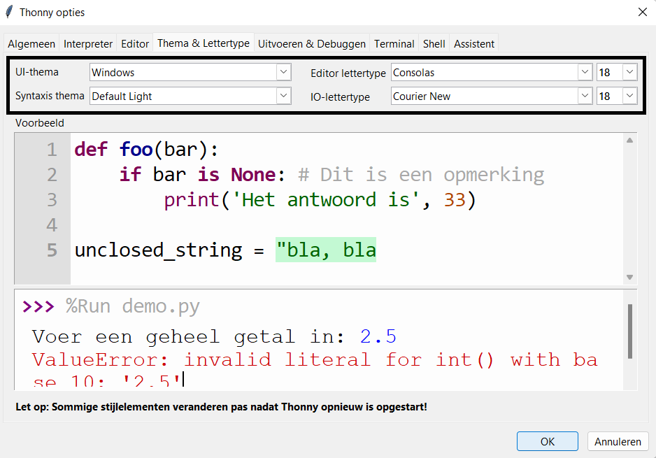

Met Thonny kun je het thema en lettertype van de software wijzigen. Deze functie betekent dat je de lettergrootte kunt vergroten en de achtergrond- en tekstkleuren kunt aanpassen aan je behoeften.

Het thema en lettertype wijzigen:

+ Klik op Tools -> Options.
+ Klik op het tabblad 'Theme & Font'.
+ Klik op de vervolgkeuzelijsten voor elke optie totdat je de instellingen vindt die het beste bij je wensen passen.

+ Druk op OK als je klaar bent.

**Waarschuwing**: Houd eenvoudige, zuivere lettertypen aan. Als je een handschrift stijl gebruikt, kan het moeilijk zijn om te lezen en fouten op te sporen.

