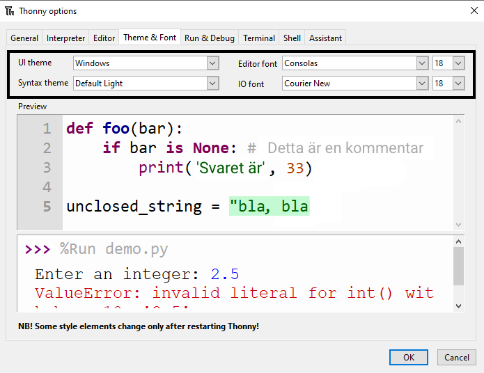

Thonny låter dig ändra temat och teckensnittet för programvaran. Denna funktion innebär att du kan öka teckenstorleken och ändra bakgrunds- och textfärger för att passa dina behov.

Så här ändrar du tema och teckensnitt:

+ Klicka på Tools -> Options.
+ Klicka på fliken "Theme & Font".
+ Klicka på rullgardinsmenyn för varje alternativ tills du hittar de inställningar som bäst passar dina behov.

+ Tryck på OK när du är klar.

**Varning**: Håll dig till enkla, rena typsnitt. Om du använder en skrivstilsteckensnitt kan det bli svårt att läsa och felsöka.

